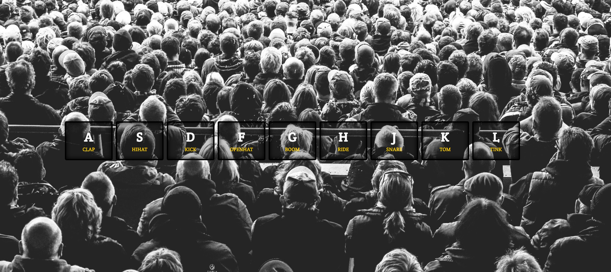

# TheOdinProject JavaScript Course

This is a solution to the [JS Drumkit tutorial by Wes Bos](https://www.frontendmentor.io/challenges/qr-code-component-iux_sIO_H) as part of [TheOdinProject](https://www.theodinproject.com) JavaScript Course.

## Overview

This is a single-page website which simulates a drum kit via JS. You can click the buttons on your keyboard or with your mouse to produce various drum sounds.

### Screenshot

### Links

- Live Site URL: [https://drumkit-snowy.vercel.app/](https://drumkit-snowy.vercel.app/)

## My process

Step 1:

I watched the introduction to the tutorial and then proceeded to build the page myself.

Step 2:

I watched the tutorial and refactored my code with the new knowledge I acquired. 

### Built with

- Semantic HTML5 markup
- CSS custom properties
- Flexbox
- CSS Grid
- Vanilla Javascript

### What I learned

CSS:

* Make inset shadows
* Basics of grid

JavaScript:

* DOM Manipulation
* Event Listeners - overall
  * Bubbling, Propagation
  * EventListeners "options" parameter - more  specifically {once:true}
* Creating  and utilizing custom html attributes with "data-"
* Playing audio with the Audio class
* Working with buttons - keystrokes and clicks. 
  * Bubbling,

### Continued development

1. Get more comfortable with Grid and Flexbox.
2. Learn to create modern page layouts

## Author

- Petar Petrov
- Twitter - [@petarchou](https://twitter.com/petarchou)

